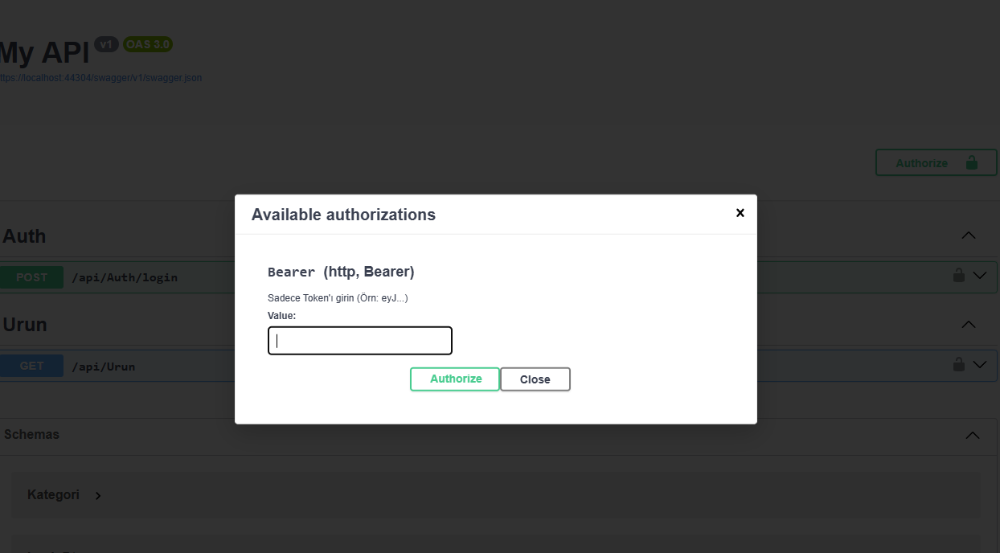
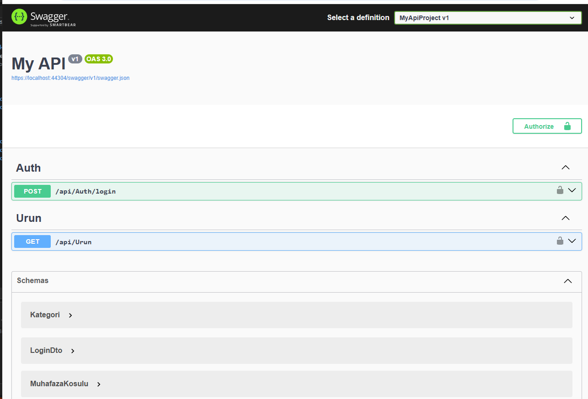
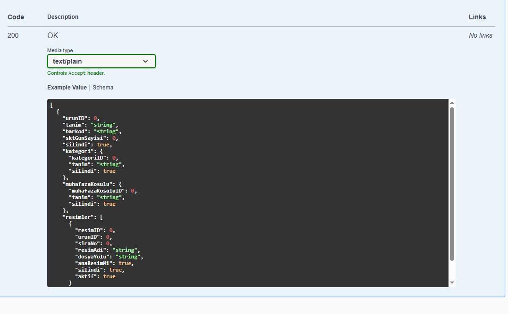

# 🔐 ASP.NET Core JWT Authentication & Authorization API

Bu proje, **ASP.NET Core Web API** kullanılarak geliştirilmiş, modern ve güvenli bir **JWT (JSON Web Token) tabanlı kimlik doğrulama ve yetkilendirme sistemidir**.

Amaç; gerçek dünya projelerinde kullanılabilecek, **temiz, sade ve genişletilebilir bir authentication altyapısı** sunmaktır.

---

## 🚀 Proje Özellikleri

* 🔐 JWT (Bearer Token) ile kimlik doğrulama
* 🛡️ Role-based Authorization (Admin yetkilendirme)
* ⚙️ Katmanlı yapı (Controller - Service)
* 📦 Dependency Injection kullanımı
* 🧩 Swagger UI üzerinden test edilebilir yapı
* 🔒 Güvenli token üretimi (HmacSha256)
* ⏱️ Token expiration (süre yönetimi)
* 🧠 Clean ve anlaşılır kod mimarisi

---

## 🛠️ Kullanılan Teknolojiler

* ASP.NET Core Web API
* JWT (System.IdentityModel.Tokens.Jwt)
* Swagger (Swashbuckle)
* Dependency Injection
* C#

---

## 🔑 Kimlik Doğrulama Akışı

1. Kullanıcı `/api/auth/login` endpoint’ine kullanıcı adı ve şifre ile istek atar
2. Başarılı doğrulama sonrası JWT token üretilir
3. Bu token, `Authorization: Bearer {token}` şeklinde header’a eklenir
4. `[Authorize]` attribute’u ile korunan endpoint’lere erişim sağlanır
5. Role kontrolü `[Authorize(Roles = "Admin")]` ile yapılır

---

## 📌 Örnek Kullanım

### 🔐 Login

```http
POST /api/auth/login
```

```json
{
  "username": "admin",
  "password": "1234"
}
```

### 🔑 Token Kullanımı

```http
Authorization: Bearer YOUR_TOKEN
```

---

## 🧪 Swagger ile Test

Projeyi çalıştırdıktan sonra:

```url
https://localhost:{port}/swagger
```

1. `Auth/login` endpoint’i ile token alın
2. Sağ üstteki **Authorize** butonuna tıklayın
3. `Bearer {token}` formatında token girin
4. Protected endpoint’leri test edin

---

## 📂 Proje Yapısı

```
Controllers/
 ├── AuthController.cs
 └── WeatherForecastController.cs

Services/
 ├── IAuthService.cs
 └── AuthService.cs
```

---

## 🔒 Güvenlik Notları

* JWT secret key minimum 256 bit olacak şekilde yapılandırılmıştır
* Token süresi sınırlıdır (default: 15 dakika)
* Role bazlı erişim kontrolü uygulanmaktadır

---

## 🎯 Geliştirme Alanları

Bu proje aşağıdaki özelliklerle genişletilebilir:

* 🔄 Refresh Token sistemi
* 🗄️ Veritabanı entegrasyonu (EF Core)
* 👥 Çoklu rol yönetimi (Admin / User / Moderator)
* 🔐 Policy-based authorization
* 📱 Frontend entegrasyonu (React / Angular)

---

## 👨‍💻 Amaç

Bu proje, portföyümde yer alan **referans projelerden biri** olup,
.NET ekosisteminde **authentication & authorization konularındaki yetkinliğimi göstermek amacıyla geliştirilmiştir.**

---

## 📸 Proje Görselleri  <br/>

<p align="center">
  
</p>
<p align="center">
  
</p>
<p align="center">
  
</p>


## 📬 İletişim

Yeni projeler, iş birlikleri veya teknik görüşmeler için benimle iletişime geçebilirsiniz.
